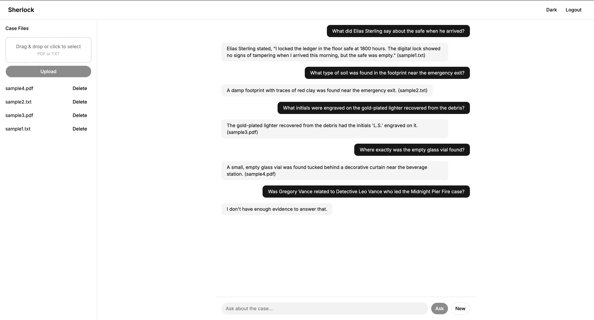

# Sherlock

A RAG-based document intelligence system. Upload PDF and text case files, then ask questions about them in natural language. Answers come strictly from the uploaded documents, the system will not guess or use outside knowledge.



## Tech Stack

- **Backend:** FastAPI, Agno, ChromaDB, Gemini 2.5 Flash
- **Embeddings:** Hugging Face Inference API
- **Frontend:** React, Vite, TypeScript, Tailwind v4, shadcn
- **Deployment:** Docker

## Requirements

- Docker and Docker Compose
- A Google AI API key (for the LLM)
- A Hugging Face token (for embeddings)

## Setup

1. Copy the example env file and fill in your keys:

```bash
cp .env.example .env
```

2. Open `.env` and set:

```
GOOGLE_API_KEY=your_google_api_key
HF_TOKEN=your_huggingface_token
```

The `USERNAME` and `PASSWORD` fields control who can log in. Defaults are `detective` and `sherlock`.

## Running

```bash
docker-compose up --build
```

Then open http://localhost:8000 in your browser.

## Usage

1. Log in with your username and password
2. Upload PDF or plain text files using the sidebar
3. Ask questions about the uploaded files in the chat
4. To remove a file, click Delete next to it in the sidebar

## Samples

The `samples/` directory contains test files I used during development: two plain text files, two PDFs, and a `tests.txt` file with sample questions to ask against the documents.

> **Disclaimer:** All sample content and test questions in this directory were generated using AI.

## API Keys

- **Google AI API key**: get one at https://aistudio.google.com/app/apikey
- **Hugging Face token**: get one at https://huggingface.co/settings/tokens (Read access is enough)

## Running locally without Docker

```bash
# Backend
cd backend
python -m venv .venv && source .venv/bin/activate
pip install -r requirements.txt
uvicorn app.main:app --reload --port 8000

# Frontend (separate terminal)
cd frontend
npm install && npm run dev
```

The frontend dev server runs on http://localhost:5173 and proxies API requests to the backend. If that port is taken, Vite picks the next available one and prints the actual URL in the terminal.
